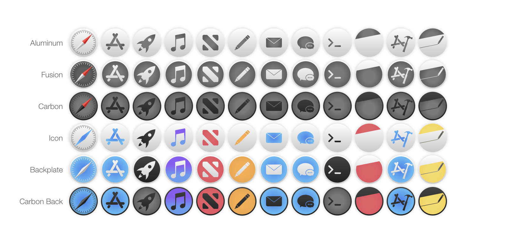

# MacOS Skin
Custom icon sets for MacOS Apps.

# Using Custom Icons

_Warning: Disabling [System Integrity Protection (SIP)](https://support.apple.com/en-us/HT204899) is required to use skins on pre-installed Apps_

If you do not need to change skins for system Apps, skip the following step

## Disabling SIP

_Warning: You will not have access to these instructions while disabling SIP. Write them down, or open on another device._

1. Restart your Mac.  > Restart...
2. Hold ⌘R during boot. (This opens Recovery Mode)
3. In the toolbar: Utilities > Terminal
4. run `csrutil disable`
5. Restart your Mac.  > Restart...

## Using the Skins

1. Copy the icon to clipboard:
    - Right click > Get Info... > Preview; select and copy (⌘C)
    - You **CAN NOT** simply copy the file
    - You **CAN NOT** copy the icon from the top left of the Get Info pane, you must copy from the preview tab within the pane
2. Paste the icon in the application:
    - Finder > Applications > _Your Target_ > Right Click > Get Info... > Preview; select top left thumbnail and paste (⌘V)

_Troubleshooting_

If the new icon looks like a peice of paper inscribed with "ICNS", it was copied incorrectly.
Workaround: Open the image file in the Preview App, select all, then copy.

## Refreshing the Dock

1. If your new icons are not displayed in the dock, open terminal:

`killAll Dock`

2. Open each app, and the icon should be updated.

## Enabling SIP

_Warning: You will not have access to these instructions while enabling SIP. Write them down, or open on another device._

1. Restart your Mac.  > Restart...
2. Hold ⌘R during boot. (This opens Recovery Mode)
3. In the toolbar: Utilities > Terminal
4. run `csrutil enable`
5. Restart your Mac.  > Restart...

## Authors

* [**Michael Verges**](https://github.com/maustinstar) - *Initial icon designs* - mverges3@gatech.edu

* **Nguyen Truong** - *Color Folders* - truongtringuyen.plus@gmail.com
